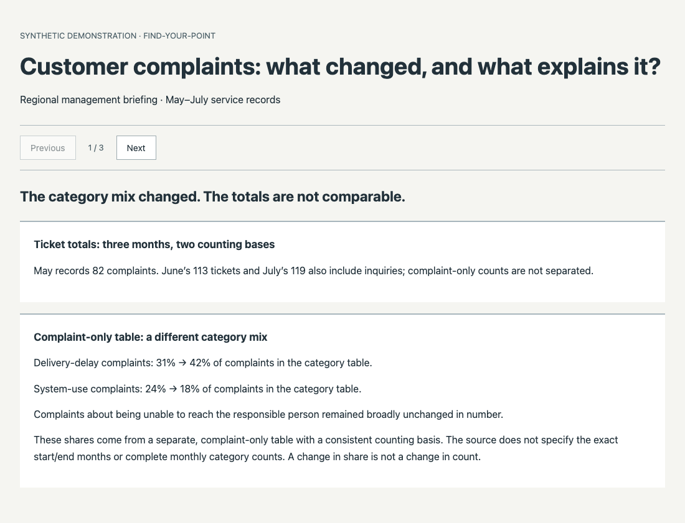
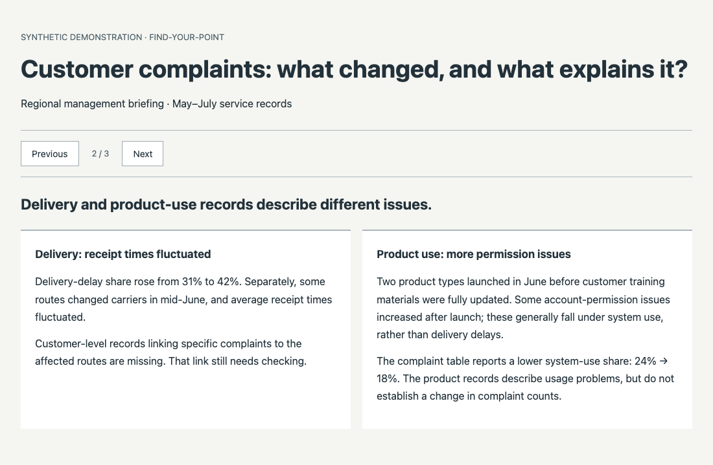
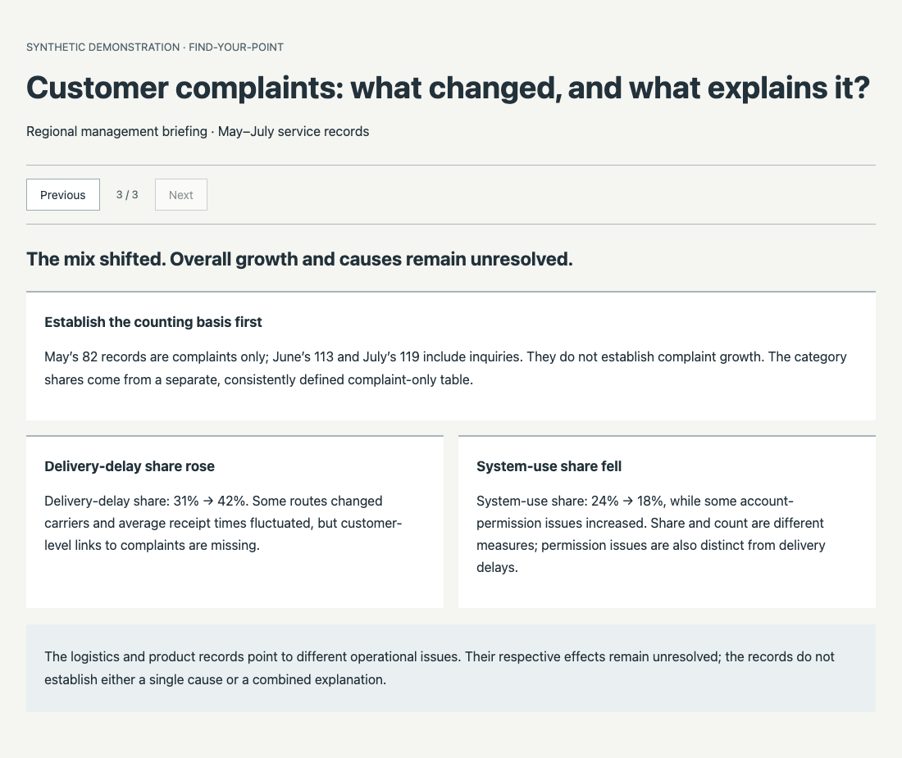

# find-your-point

**Stop making slides. Start making your point.**

### You bring the materials. Not the answers.

You shouldn't have to analyze, summarize, and organize everything yourself just to get AI to create a useful presentation.

**this skill does the heavy thinking first.** It guides your agent to read your materials, discover what matters, and build a clear story around what your audience needs to understand — **without making you figure out the structure first.**

The agent handles the analysis and priority work organization, asking for your input when a decision genuinely needs you.


## You did the work. Let AI find the story.

You have Project updates, spreadsheets, meeting notes, feedback. A template-first workflow might organize them into 
**Background → Progress → Achievements → Next Steps**. While this skill can:

- **Find what matters.** Discover meaningful changes, relationships, and potential value across your materials.
- **Think beyond templates.** Shape the narrative around your audience, not predefined chapters.
- **Keep claims grounded.** Connect important findings to sources; separate evidence from assumptions.
- **Own the result.** Keep the HTML and editable source files, and refine them with your agent.

## From Scattered Materials to a Clear Point
**Scattered inputs → important findings → audience-first briefing**

**📑 Input — Scattered Materials**

Complaint records, delivery data, product feedback, and management assertions.

<p align="center">↓</p>

**🧠 Insight — What Actually Matters**

Complaint categories shifted, but not every number is directly comparable. The evidence reveals meaningful patterns — without proving what caused them.

<p align="center">↓</p>

**🖥️ Output — A Briefing Built Around Understanding**

A clear, editable HTML briefing that connects the findings, explains what the evidence supports, and guides your audience toward the key takeaway.

**Not just organized information. A point worth making.**


## Example Story.

Imagine you're preparing a business review with three months of customer support reports, delivery records, and product feedback.

### 📋 A typical template-first briefing

**Background → Complaint Trends → Root Causes → Action Plan**

Everything is neatly organized.

But it might miss the most important question:

**Did customer complaints actually increase?**

### 💡 With find-your-point

Instead of filling a predefined outline, the AI examines the evidence and discovers:

**01 · The apparent increase may be misleading.**

One month's report counts complaints. Later reports also include customer inquiries. The totals aren't directly comparable.

**02 · But something meaningful did change.**

A separate, consistently defined complaint breakdown reveals a change in the types of issues customers reported.

**03 · And the causes? Still unproven.**

Delivery and product records offer clues, but the available evidence doesn't establish what's driving the change.

### 🎯 The briefing now has a point.

**What changed isn't necessarily how many customers complained — it's the mix of problems they reported. And understanding why requires more evidence.**

Instead of another routine status report, your audience gets a clear, evidence-grounded way to understand the problem.

**Same materials. Less guesswork. A much better story.**

*See what you get below.*


### 1. Find the comparison that actually holds



The briefing separates non-comparable ticket totals from the complaint-only category table.

<details>
<summary>2. Examine the business clues separately</summary>



Delivery records and product-use records describe different issues, with different evidence gaps.

</details>

<details>
<summary>3. Bring the findings together without inventing a cause</summary>



The synthesis keeps the valid category changes visible while preserving the unresolved count trend and attribution.

</details>

[Explore the synthetic inputs](examples/integrated-task-slice/source-packet.md) and [source correction](examples/integrated-task-slice/source-revision.md). To run the English demo, download the whole repository and open `examples/integrated-task-slice-en/index.html`. No build step is needed.

## Install & try

Works with supported **Agent Skills-compatible AI agents**. Installation uses [Skills CLI](https://github.com/vercel-labs/skills), which lets you select your agent.

```sh
npx skills add Kaisenberg-36/find-your-point
```

Then tell your agent:

> Use find-your-point. Read the materials in [my folder], find what really matters, and create a clear, editable briefing for [my audience]. Don't just summarize — help me make the point. Save the result in outputs/first-briefing/.

Bring authorized files and whatever you already know about the audience. You do not need to pre-summarize them. Your agent needs file access, editing and execution tools, readers for your formats, and a way to inspect rendered HTML. [Setup and dependencies](docs/USAGE.md).

## What you own

Open `outputs/first-briefing/index.html` and keep its **whole folder**: HTML, editable content, styles, scripts, and handoff notes. Ask your agent to revise it; evidence changes require reviewing the conclusions they support.
**And you can continue to modify these materials in your agent, everything keeps editable.**

**Available:** material-first reasoning, adaptive narrative guidance, evidence records and checks, editable local HTML. **Experimental:** quality across new tasks and agents. **Planned:** full Evidence Mode, richer editing, print/PDF, and deeper visual and motion craft. Source tracing does not independently verify source truth.

if you have any question or suggestion, please contact me.
